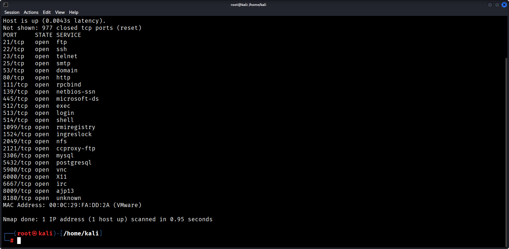
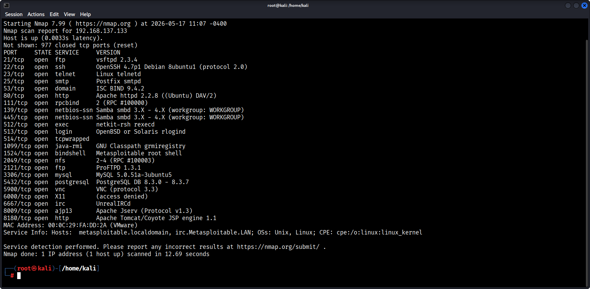
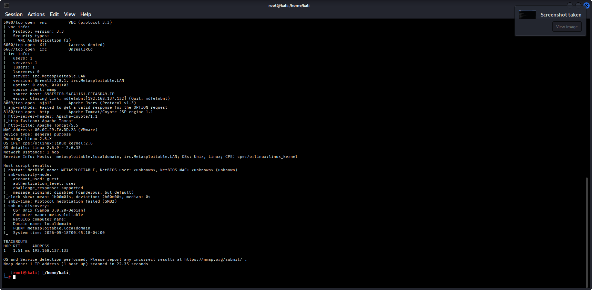
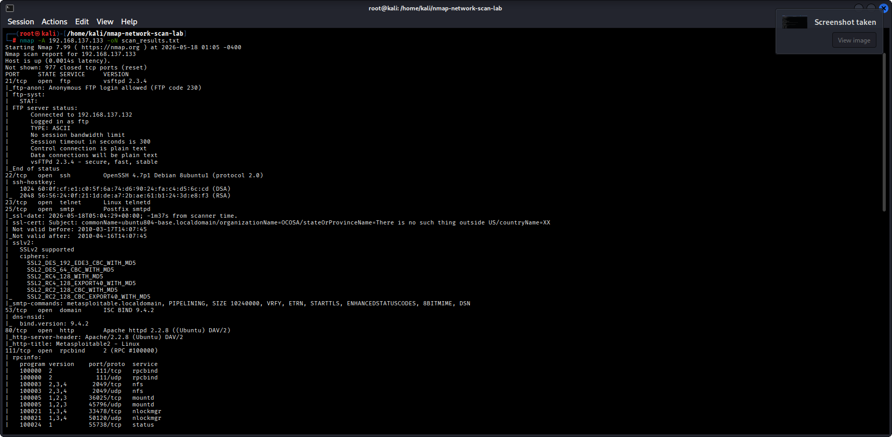

# Nmap Network Scan Lab

## Introduction
This project demonstrates network reconnaissance and service enumeration using Nmap against a Metasploitable2 virtual machine in a controlled lab environment.

## Objectives
- Perform TCP SYN scanning
- Detect active services
- Identify operating system information
- Analyze security risks and exposed services

## Tools Used
- Kali Linux
- Nmap
- Metasploitable2
- VMware Workstation

## Commands Used

```bash
nmap -sS 192.168.137.133
nmap -sV 192.168.137.133
nmap -A 192.168.137.133
nmap -p- 192.168.137.133
```

## Key Findings

| Port | Service | Security Risk |
|------|----------|----------------|
| 21 | FTP | Anonymous login enabled |
| 22 | SSH | Possible brute-force attacks |
| 23 | Telnet | Plaintext communication |
| 80 | Apache HTTP | Outdated web server |
| 445 | Samba | SMB vulnerabilities |
| 3306 | MySQL | Database exposure |
| 6667 | UnrealIRCd | Known backdoor vulnerability |
| 8180 | Apache Tomcat | Possible default credentials |

## Security Risks Identified

- Anonymous FTP access allowed
- SMB message signing disabled
- Outdated Apache server version
- Telnet service enabled
- Multiple vulnerable services exposed

## Skills Demonstrated

- Network reconnaissance
- Service enumeration
- OS fingerprinting
- Vulnerability identification
- Security docum
## Screenshots

### TCP SYN Scan


### Service Detection


### OS Detection


### Scan Results


## Learning Outcomes

- Learned practical Nmap scanning techniques
- Improved understanding of exposed network services
- Practiced vulnerability analysis in a lab environment
- Gained hands-on experience with penetration testing reconnaissance

## Conclusion

This project improved my practical understanding of network scanning, service enumeration, and vulnerability assessment using Nmap in a penetration testing environment.

